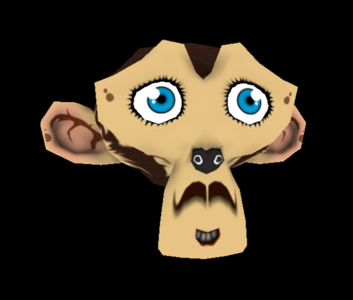

# Loading meshes exported from Blender.

모델링 툴에서 생성한 복잡한 지오메트리와 텍스처를 사용하여 MoGL에서 메시를 생성하는 방법을 알아봅니다.

## Preview

이미지를 클릭하여 예제를 확인할 수 있습니다.

[](http://projectbs.github.io/MoGL/showcase.0.1/monkey.html)

## 시작하기 앞서

두 개의 리소스 파일이 필요합니다. 바로 로드할 모델링 데이터와 텍스처로 사용할 이미지입니다.
모델링 데이터를 생성하는 툴, 플러그인은 종류가 굉장히 많지만 이 예제에서는 Blender 툴에서 Babylon Exporter 플러그인을 사용하여 생성한 모델링 데이터와 텍스처 이미지를 사용합니다.
예제에서 사용된 리소스 파일은 [모델링 파일](https://raw.githubusercontent.com/projectBS/MoGL/dev/showcase.0.1/monkey/monkey.babylon), [텍스처 이미지](https://raw.githubusercontent.com/projectBS/MoGL/dev/showcase.0.1/monkey/Suzanne.jpg) 링크를 선택해 다운로드할 수 있습니다.

그리고 물론 MoGL 라이브러리 파일이 필요합니다.
[MoGL Release 페이지](https://github.com/projectBS/MoGL/releases) 링크에서 최신 버전을 다운로드할 수 있고 이 예제는 0.1 버전을 사용하였습니다.

이 예제는 MoGL의 기본적인 사용법은 다루지 않습니다.
기본적인 사용법을 익히고 싶다면 [시작하기](https://github.com/projectBS/MoGL/blob/master/GETTING-STARTED.md) 링크를 먼저 확인해 주세요.

**1. Material( 재질 ) 등록하기**

먼저 메시에서 사용할 Material(재질)을 Scene(장면)에 등록해 줍니다.

```javascript
scene.addMaterial( 'material', new Material() );
```

등록시에 첫번째 인자는 고유한 id를 문자열로 부여하고 두번째에 객체를 넣어줍니다.

그리고 사용할 Texture(이미지)를 장면에 등록해 줍니다.

```javascript
scene.addTexture( 'texture', 'monkey/Suzanne.jpg' );
```

등록시에 첫번째 인자는 고유한 id를 문자열로 부여하고 두번째에 사용할 이미지의 경로를 넣어줍니다.

장면에 등록된 재질에 텍스처 이미지를 적용합니다.

```javascript
scene.getMaterial( 'material' ).addTexture( Texture.diffuse, 'texture' );
```

장면의 getMaterial 메소드에 재질의 id를 넣어줌으로써 재질을 얻어오고 재질의 addTexture 메소드를 통해 텍스처를 적용합니다.
addTexture의 첫번째 인자는 해당 텍스처가 어떠한 타입에 포함될 것인가를 결정하는 타입이고 두번째에 사용할 텍스처의 고유한 id를 넣어줍니다.

이로써 재질은 준비가 완료가 됩니다.
다음 단계로 모델링 데이터를 로드하고 지오메트리를 생성해 보겠습니다.

**2. 모델링 데이터 로드하기**

```javascript
var xmlhttp = new XMLHttpRequest();
xmlhttp.open( 'GET', 'monkey/monkey.babylon', true );
xmlhttp.onreadystatechange = function() {
    if( xmlhttp.readyState === 4 && xmlhttp.status === 200 ) {
        // 로드해 온 json 데이터를 통해 
        // 지오메트리를 생성하고 재질과 합쳐 메시를 생성
        start( JSON.parse( xmlhttp.responseText ) );
    }
};
xmlhttp.send( null );
```

일반적인 json 데이터를 로드해 오는 코드입니다.
로드해 온 json 데이터를 파싱하여 Geometry를 생성하는 부분을 살펴보겠습니다.

**3. Geometry( 기하구조 ) 등록하기**

Geometry를 생성하기 위해서는 3차원 상에서 점들의 위치와 점들이 연결되어 있다는 인덱스 정보를 넣어주어야 합니다.
우리가 로드해 온 json 데이터에는 바로 이 데이터들이 있습니다.
그리고 추가적으로 법선 좌표, UV좌표가 더 있습니다.

로드해 온 json 데이터에는 vertices, indices 배열이 있고 이 부분이 바로 Geometry에서 필요로 하는 좌표 데이터들입니다.
Geometry는 vertexinfo를 직접 지정할 수가 있기 때문에 정점 배열을 자유롭게 구성이 가능합니다.

예제에서는 정점 좌표, 법선 좌표, UV 좌표 순으로 vertex 배열에 담습니다.

```javascript
// json의 meshes 배열에서 필요한 첫번째 모델링 데이터를 얻어옵니다.
var mesh = json.meshes[0];
// 모델링 데이터에는 정점 배열( vertices )와 인덱스 정보( indices )가 있습니다.
var vertices = mesh.vertices;
var indices = mesh.indices;
var vertex = [];
var index = [];

// 정점 배열을 돌면서 필요한 데이터( 정점 좌표, 법선 좌표, UV좌표 )를 vertex 배열에 담습니다.
for( var i = 0; i < vertices.length; i++ ) {
    var j = i * vertexStep; // 필요한 좌표만 얻어내기 위한 vertexStep
    // 정점 좌표 x, y, z, 법선 좌표 x, y, z
    vertex.push( vertices[j], vertices[j + 1], vertices[j + 2], vertices[j + 3], vertices[j + 4], vertices[j + 5] );
    
    // UV 좌표
    if( uvCount > 0 ) {
        vertex.push( vertices[j + 6], vertices[j + 7] );
    } else {
        vertex.push( 0, 0 );
    }
}

// 인덱스 배열을 돌면서 필요한 데이터( 인덱스 정보 )를 index 배열에 담습니다.
for( i = 0; i < indices.length; i++ ) {
    var k = i * 3;
    index.push( indices[k], indices[k + 1], indices[k + 2] );
}

var geometry = new Geometry( vertex, index, [Vertex.x, Vertex.y, Vertex.z, Vertex.normalX, Vertex.normalY, Vertex.normalZ, Vertex.u, Vertex.v] );
scene.addGeometry( 'geometry', geometry );
```

Geometry 생성자의 첫번째 인자는 정점 배열, 두번째 인자는 인덱스 배열입니다.
세번째 인자는 vertexinfo 배열이고 정점 배열이 어떤 순서로 정의되어 있는지를 정의할 수 있습니다.
예제에서는 x, y, z, normalX, normalY, normalZ, u, v 순으로 정의되어있습니다.

이렇게 생성한 Geometry 객체를 scene에 등록해 줍니다. 첫번째 인자는 고유한 id를 문자열로 부여하고 있습니다. 두번째 인자로 생성한 Geometry 객체를 넣어줍니다.


**4. Mesh(메시) 만들기**

이제 지오메트리와 재질이 준비 되었으니 메시를 생성할 수 있게 되었습니다.

```javascript
var mesh = new Mesh( 'geometry', 'material' );
scene.addChild( 'monkey', mesh );
```

장면에 이미 등록되어 있는 지오메트리의 아이디와 재질의 아이디만으로 하나의 랜더링 단위인 메시를 생성하여 장면에 추가하였습니다.
장면에 추가하는 addChild 메소드의 첫번째 인자는 고유한 id를 문자열로 부여하고 있습니다. 두번째 인자는 생성한 Mesh 인스턴스입니다.

여기까지가 완료되면 World의 render 함수를 호출하는 것으로 장면에 추가된 메시를 랜더링할 수 있게 됩니다.
예제에서는 랜더링 루프를 돌면서 메시의 rotateY 값을 갱신해 주면서 render 함수를 호출하고 있습니다.

**5. 랜더링하기**

```javascript
function render() {
    mesh.rotateY -= 0.01;
    world.render();

    requestAnimationFrame( render );
}

requestAnimationFrame( render );
```

Blender에서 생성한 모델링 데이터를 로드해서 MoGL에서 메시를 생성하고 제어하는 [예제의 완성](http://projectbs.github.io/MoGL/showcase.0.1/monkey.html)입니다.

**6. 더 보기**

MoGL은 한번 등록한 기하구조와 재질을 고유한 id를 통해서 얼마든지 재사용이 가능합니다.

```javascript
for( var i = 0; i < 500; i++ ) {
    scene.addChild( 'monkey' + i, new Mesh( 'geometry', 'material' ) );
}
```

500개의 메시를 생성하여 장면에 추가하고 있습니다.

[링크](http://projectbs.github.io/MoGL/showcase.0.1/monkeys.html)에서 확인 가능합니다.

**7. 참고 API**

* [Scene](https://github.com/projectBS/MoGL/blob/master/doc/Scene.md)
* [Material](https://github.com/projectBS/MoGL/blob/master/doc/Material.md)
* [Geometry](https://github.com/projectBS/MoGL/blob/master/doc/Geometry.md)
* [Mesh](https://github.com/projectBS/MoGL/blob/master/doc/Mesh.md)
* [World](https://github.com/projectBS/MoGL/blob/master/doc/World.md)
